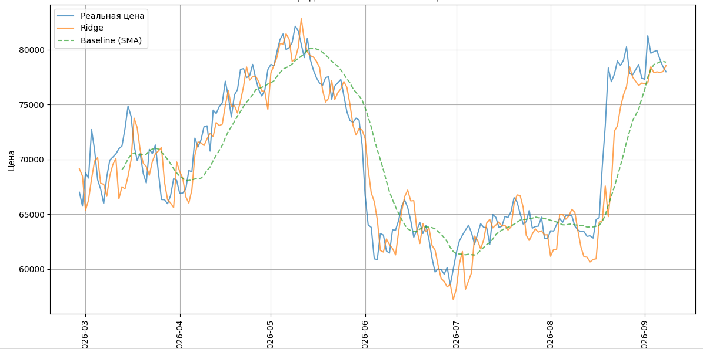
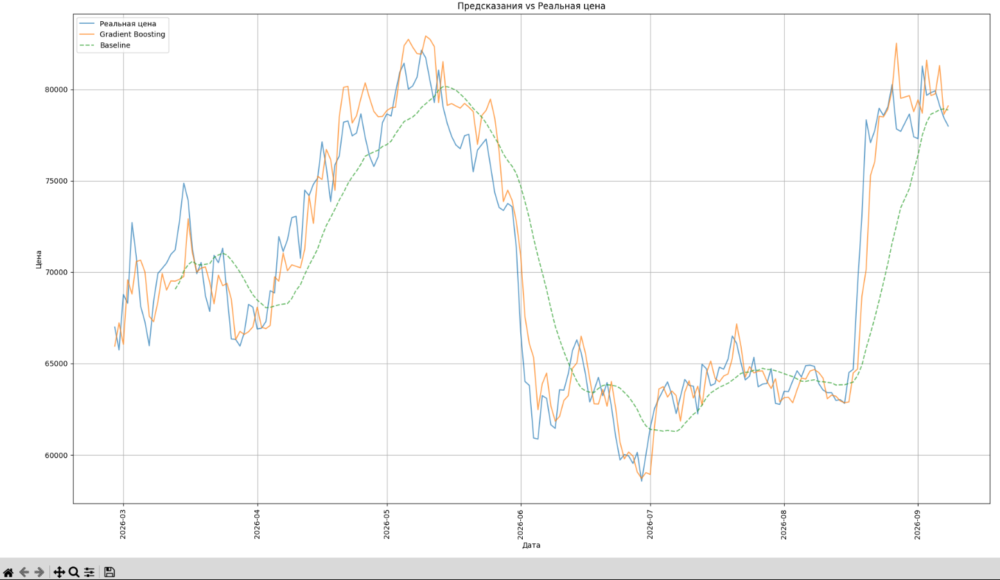
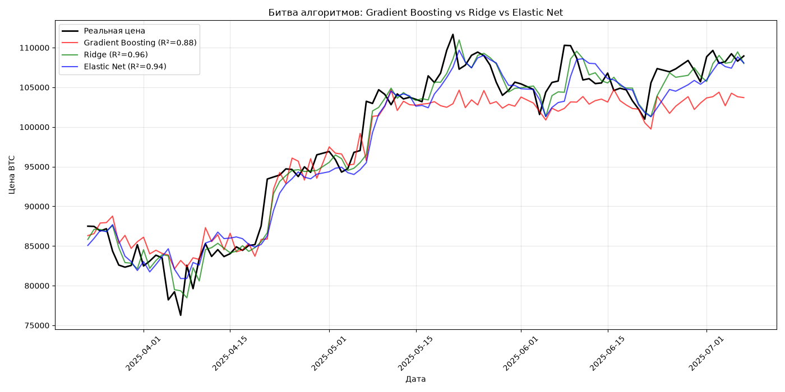
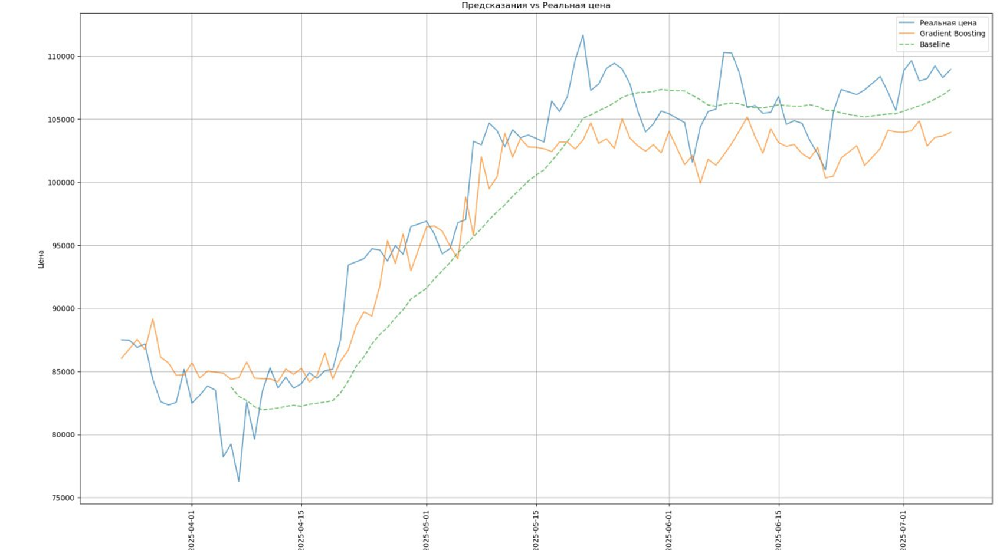
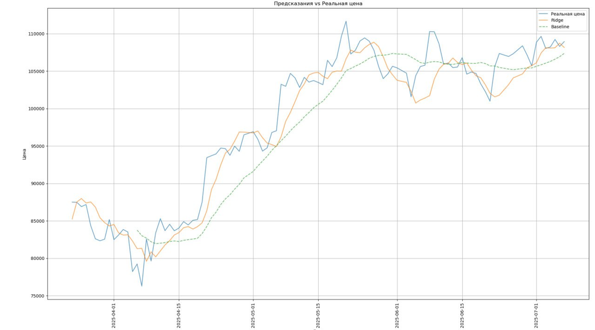

data - хранение всех необходимых csv и json наборов данных;

data\_handdaling - обработка csv и json данных;

mls - модели обучения - ml3 - для эксперементов, модели по типу gb\_r2\_86.py - рабочие версии.

ЗАПУСК:
1) Запустить аггрегатор zub.py - данные автоматически загрузятся из сети
2) Запускать модели из mls

ТЕСТЫ:

